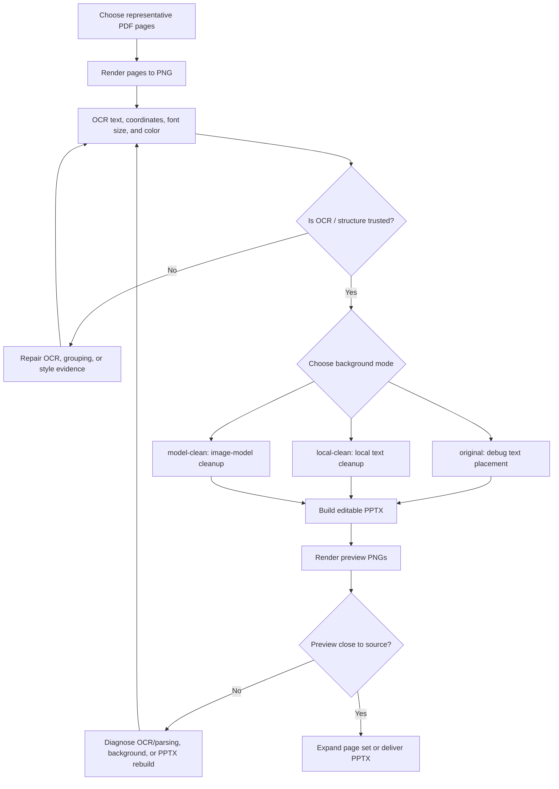

# NotebookLM PDF To PPT

[中文](README.md) | English

Convert flattened NotebookLM-style slide PDFs into editable PowerPoint decks. This skill focuses on post-export reconstruction: OCR, background text cleanup, editable PPTX rebuild, preview rendering, and quality diagnosis.

This is a **v0.1.0 preview** skill. It is useful for representative-page testing and workflow iteration, but it is not yet a guaranteed high-fidelity full-deck converter.

## Who Should Use It

- Users who want to turn NotebookLM slide PDF exports into editable PPTX files.
- Developers studying image-based PDF/PPT reconstruction.
- Agent users who want to trigger a local conversion workflow through chat.
- Workflow designers who need representative-page diagnostics before processing a full deck.

Not a good fit for:

- Users expecting one-click 100% reconstruction for complex slide decks.
- Use cases that require every icon, chart, illustration, and shape to become editable.
- NotebookLM content generation, podcasts, study guides, or quizzes.

## What It Does

- Renders selected PDF pages into PNG images.
- Extracts OCR text, coordinates, estimated font size, color, and grouping metadata.
- Cleans old text from the background with local fill or an optional image model.
- Rebuilds a PowerPoint file with a background image plus editable text boxes.
- Exports preview PNGs through LibreOffice and `pdftoppm` when available.
- Writes `layout.json` and `qa_summary.json` so OCR/parsing problems can be diagnosed separately from PPTX rendering problems.

## Workflow



## What It Is Not

- It does not generate NotebookLM content, podcasts, study guides, or new course materials.
- It does not promise full element-level decomposition.
- It does not turn every icon, chart, image, and diagram into editable PowerPoint objects.
- It does not replace manual visual review for final courseware delivery.

## Requirements

Required for the default local flow:

- Python 3.10+
- Python packages: `Pillow`, `python-pptx`, `numpy`
- Poppler tools: `pdftoppm`, `pdfinfo`
- LibreOffice, for preview rendering

Recommended:

- Tesseract OCR
- PaddleOCR in a separate virtual environment, configured with `PADDLEOCR_PYTHON`

Optional:

- Image model API credentials for `--background model-clean`
- `fitz` / PyMuPDF for legacy or experimental scripts
- `pptxgenjs` for the experimental JS renderer

## Install

Clone this repository, then place or symlink the repository folder into your agent skills directory so that `SKILL.md` is at the skill root.

```bash
git clone https://github.com/<owner>/notebooklm-pdf-to-ppt.git
```

Start a fresh agent session after installation if your agent runtime caches the skill list.

Verification prompt:

```text
Use notebooklm-pdf-to-ppt to check readiness and tell me which dependencies are missing.
```

## Quick Start

Run the default representative-page flow:

```bash
PYTHONDONTWRITEBYTECODE=1 python scripts/run_simple.py \
  --pdf /path/to/source.pdf \
  --pages 1,2 \
  --output-dir /path/to/output \
  --ocr auto \
  --background local-clean
```

## Core Workflows

### Representative-Page Test

Run one or two representative pages first. Pick pages by visual structure, such as title pages, text pages, illustration pages, tables, or speech-bubble dialogue pages. Inspect `05_previews/` first, then use `02_ocr/qa_summary.json` to decide whether the issue belongs to OCR/parsing, background cleanup, or PPTX rebuild.

### Local Background Cleanup

Use `--background local-clean` for white, flat, or simple card backgrounds. It is fast and deterministic, but it may leave visible fill blocks on illustrated pages.

### Model Background Cleanup

Use `--background model-clean` when old text is embedded in illustrations, textured backgrounds, cards, or speech bubbles. The model should remove only text pixels and preserve containers, icons, illustrations, composition, and aspect ratio.

### QA Diagnosis

When the preview differs from the source, inspect `layout.json` first. If text, coordinates, font size, or grouping are wrong, fix OCR/parsing. If layout JSON is correct but the preview is wrong, fix PPTX rebuild.

For illustrated or textured pages, use model background cleanup:

```bash
VISION_API_KEY=<your-key> PYTHONDONTWRITEBYTECODE=1 python scripts/run_simple.py \
  --pdf /path/to/source.pdf \
  --pages 1 \
  --output-dir /path/to/output \
  --ocr auto \
  --background model-clean \
  --model-provider openai-image \
  --model-clean-model gpt-image-2-all \
  --model-clean-base-url https://api.openai.com
```

## Command Reference

| Option | Purpose |
| --- | --- |
| `--pdf` | Input PDF path |
| `--pages` | Page selection, such as `1,2` or `3-5` |
| `--output-dir` | Output directory |
| `--ocr` | `auto`, `paddle`, or `tesseract` |
| `--background` | `original`, `local-clean`, or `model-clean` |
| `--model-provider` | Image model provider type |
| `--model-clean-model` | Background cleanup model name |
| `--model-clean-base-url` | Model API base URL |
| `--model-clean-api-key-env` | Environment variable that stores the API key |
| `--model-clean-fallback` | Fallback behavior when model cleanup fails |
| `--no-preview` | Skip LibreOffice preview export |

## Output Structure

```text
output/
├── 01_rendered/        # rendered source pages
├── 02_ocr/             # layout.json and qa_summary.json
├── 03_cleaned/         # local-clean backgrounds
├── 03_model_cleaned/   # model-clean backgrounds
├── 04_pptx/            # editable_text_overlay.pptx
└── 05_previews/        # preview PNGs when available
```

## Quality Rules

- OCR/parsing owns text content, coordinates, grouping, font size, color, and style evidence.
- PPTX rebuild owns deterministic unit conversion, font substitution, text-box margins, and line spacing.
- If OCR is wrong, fix OCR/parsing first. Do not compensate by moving text in the renderer.
- If layout JSON is correct but the preview is wrong, fix the renderer.
- Continuous rows in the same visual region, column, card, bubble, or panel may be rebuilt as one editable paragraph while preserving visible line breaks.
- Tables, list rows, glossary rows, Q/A pairs, separate cards, and titles should not be merged unless structure evidence proves they belong to one editable block.

## Readiness Check

```bash
python scripts/check_readiness.py
```

This check is read-only. It reports local dependencies and does not install packages or call external APIs.

For public release checks:

```bash
python scripts/smoke_test.py
python scripts/publish_check.py
```

## Repository Structure

```text
notebooklm-pdf-to-ppt/
├── SKILL.md
├── README.md
├── README.en.md
├── LICENSE
├── agents/
├── references/
└── scripts/
```

## Compatibility

Designed to be portable across Codex, Claude Code, and OpenClaw. Current local validation has been performed in Codex; Claude Code and OpenClaw should treat scripts as standard local command helpers and may require their own dependency setup.

## License

MIT
